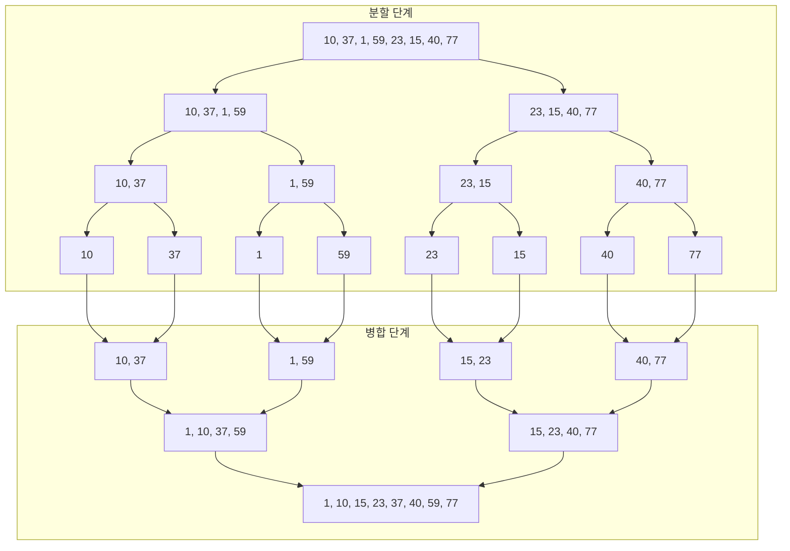

# Code Test
---
```python
print("hello world")
```


# Image Test
---
- 
# Mermaid Test
---


# Equation Test
---
$$f(\mathrm x)=\large{\sum^{n_{L-1}}_{i_{L-1}=1}\phi_{L-1,i_L,i_{L-1}}\Bigg(
	  \sum^{n_{L-2}}_{i_{L-2}=1}\dots\bigg(
		  \sum^{n_{2}}_{i_{2}=1}\phi_{2,i_3,i_{2}}\bigg(
			  \sum^{n_{1}}_{i_{1}=1}\phi_{1,i_2,i_{1}}\bigg(
				  \sum^{n_{0}}_{i_{0}=1}\phi_{0,i_1,i_{0}}(x_{i_0})
				  \bigg)
			  \bigg)
		  \bigg)
	  \dots\Bigg)}\tag{2.8}$$
	  